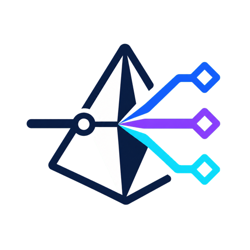
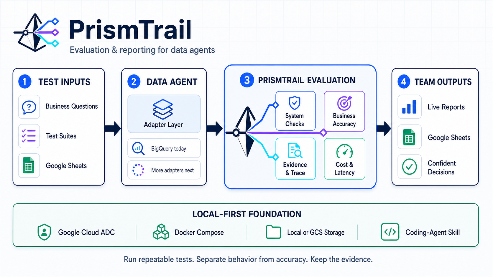

<p align="center">
  
</p>

# PrismTrail

[English](./README.md) · [アーキテクチャ](./ARCHITECTURE.md) · [セキュリティ](./SECURITY.md) · [コントリビューション](./CONTRIBUTING.md)

> データエージェントを対象に、ローカルで回帰テスト・精度評価・Google Sheets
> レポーティングを行う評価基盤です。

<p align="center">
  
</p>

PrismTrailは、繰り返し確認したい実業務の質問をテストスイートとして管理します。最初の
アダプターはBigQuery Data AgentのレスポンストレースとBigQuery Job情報を取得します。動作の健全性とビジネス上の
正確性を分けて評価し、Web UIとGoogle Sheetsへ共有しやすいレポートを出力します。

ローカルPCとコーディングエージェントでの利用を想定しています。認証にはApplication
Default Credentials（ADC）を使用し、アクセストークンや認証情報をリポジトリやブラウザへ
保存しません。

> [!IMPORTANT]
> 本プロジェクトはGoogle公式製品ではない独立したOSSです。BigQuery Data Agentおよび関連API
> には提供地域、権限、割り当て、料金などの条件があります。実行前に
> [Google Cloud公式ドキュメント](https://docs.cloud.google.com/bigquery/docs/create-data-agents?hl=ja)
> を確認してください。

## 評価する内容

| レイヤー | 主な判定内容 | 出力 |
|---|---|---|
| システム要件 | 最終回答、エラー、SQL、チャート、時間、課金バイト、必須語句 | 合否チェックとスコア |
| ビジネス要件 | 正解値、期間、単位、許容差、回答内の根拠 | GeminiによるA/B/C/D評価 |
| レポート | 進捗、トレース、コスト、スコア、根拠、エラー | Web UIと管理対象Google Sheet |

## 主な機能

- 単一プロンプト実行と正規化レスポンストレース
- ライブ進捗を表示する再利用可能なテストスイート
- システム要件とビジネス要件のスコア分離
- 根拠付きA/B/C/D精度評価
- 生成SQL、検証済みクエリ、BigQuery Query Jobを含むSQL証跡判定
- 実行時間とBigQuery課金対象バイトの集計
- 既存Data Agentのリソース名による登録
- Google Sheetsでのテストスイート入出力と評価レポート書き戻し
- GCSナレッジ、テキスト同期、簡易検索、根拠判定
- ローカルJSON／GCSの切り替え可能なプライマリーストレージ
- macOS、Windows、Linux対応のDocker Compose
- セットアップCLIとコーディングエージェント用スキル
- 日本語／英語の完全なUI切り替え

Web UIは初回にブラウザの言語を参照し、日本語ブラウザでは日本語、それ以外では英語を
表示します。ヘッダーまたは設定画面の言語切り替えで変更でき、選択内容はローカルブラウザ
内にのみ保存されます。

## クイックスタート

### 必要なもの

- Docker Engine/DesktopとCompose
- Google Cloud CLI
- 既存BigQuery Data Agentを利用できるGoogle Cloudプロジェクト
- Data Agent、対象BigQueryデータ、Vertex AIへの権限
- GCS／Google Sheets機能を使う場合は各リソースへの権限
- セットアップCLIと開発にはNode.js 20以上

### 1. インストール

```bash
git clone https://github.com/ENOSTECH-inc/prismtrail.git
cd prismtrail
npm ci
```

### 2. `.env`を安全に作成

```bash
npm run setup -- init
```

非対話実行するコーディングエージェントでは、実在する値を明示します。

```bash
npm run setup -- init \
  --project your-google-cloud-project \
  --agent projects/your-google-cloud-project/locations/global/dataAgents/your-agent-id \
  --label "My Data Agent"
```

CLIは識別子を検証し、Git管理対象外の`.env`だけを書き込みます。トークンやサービスアカウント
キーは取得・保存しません。

### 3. ADCでログイン

```bash
gcloud auth login --enable-gdrive-access --update-adc --force
gcloud auth application-default set-quota-project YOUR_GOOGLE_CLOUD_PROJECT
```

起動後は「設定 → Google認証」でADCとCloud / Sheetsのscopeを事前診断できます。ローカル利用では、Driveアクセスを許可したユーザーADC一本でCloud・GCS・Data Agent・Sheetsを利用できます。対象シートを自分のGoogleアカウントへ共有し、各サービスのIAM権限とAPI設定を用意してください。
不足が判明している場合、全画面に警告を表示し、Data Agent実行、GCS、Google Sheetsなどの
外部API操作をリクエスト送信前に停止します。アクセストークンはブラウザへ返しません。
`gcloud auth application-default login --scopes=...spreadsheets`をgcloud既定クライアントで
実行する経路はGoogleにブロックされます。上記のDriveアクセス用ログインを使用してください。
Workspace管理ポリシーでgcloudアプリも遮断される場合は、管理者が許可したDesktop OAuth
クライアントを`--client-id-file`へ指定する代替手順を設定画面に表示します。

### 4. 診断して起動

```bash
npm run setup -- doctor
npm run setup -- up --detach
docker compose ps
```

[http://127.0.0.1:4318](http://127.0.0.1:4318) を開きます。Dockerの公開ポートは
既定でループバックインターフェースだけにバインドされます。

停止:

```bash
docker compose down
```

## セットアップCLI

```text
prismtrail init     検証済みの.envを作成
prismtrail doctor   Node、Docker、gcloud、ADC、設定を診断
prismtrail up       Docker Composeをビルドして起動
prismtrail skill    同梱エージェントスキルのパスを表示
```

グローバルインストールは不要です。`npm run setup -- <command>`で利用できます。

## コーディングエージェント用スキル

[`skills/prismtrail/SKILL.md`](./skills/prismtrail/SKILL.md) に、セットアップ、
認証、機密データの扱い、評価条件、Google Sheets/GCS操作、コード変更時の検証手順をまとめています。

Codexではスキルディレクトリを`~/.codex/skills/`へコピーまたはシンボリックリンクできます。
ほかのコーディングエージェントでも、作業前にこのファイルを読むよう指定してください。

## 基本フロー

1. 既存Data Agentを完全なリソース名で登録
2. アプリまたは管理対象Google Sheetでテストスイートを作成
3. システム要件と、必要に応じて自然言語のビジネス要件を設定
4. スイートを実行し、ケースごとの進捗を確認
5. トレース、SQL／Job証跡、スコア、コスト、精度判定理由を確認
6. `AgentEval_Report`を共有

### ビジネス要件

期待する値、対象期間、単位、許容差を自然言語で記述します。Vertex AIの判定モデルがData
Agentの回答と構造化結果を照合します。

- **A**: 完全一致
- **B**: おおむね正しい
- **C**: 一部不一致
- **D**: 不一致

既定ではA/Bを合格とします。判定モデル側の障害はDにせず「要確認」として扱います。

## Google Sheets

「設定 → Google Sheets」で、ADCのユーザーへ共有したスプレッドシートを管理対象として登録し、シート名とURLを設定してから、
登録済みData Agentを1つ紐付けます。3つのData Agentには3つの専用スプレッドシートを割り当てます。スイート入出力、評価レポート、
自動書き戻し、カタログは接続先Agentが一致する場合だけ実行され、Agent間で混在しません。
アプリが管理するタブは次の4つです。

- `AgentEval_TestSuite`: スイート情報と、根拠URLリストを含む最大120件のテストケース
- `AgentEval_Report`: スイート実行結果とケース別評価
- `AgentEval_DataAgents`: 接続先のData Agent 1件だけ
- `AgentEval_Suites`: 接続先Agentだけを使うスイート

固定タブはシートIDを維持したまま再描画します。複数Agentを含むスイートや、接続先Agentと
異なるインポート／エクスポートはサーバー側で拒否します。ユーザー作成タブは変更しません。
取り込み値は再検証し、非表示列や貼り付け内容を信頼しません。

## ストレージ

- **ローカルJSON**: 単一PCでの開発
- **Google Cloud Storage**: バケット／prefix配下でのポータブルな共有

ローカル起動でも、基本のプライマリーストレージとしてGCSを推奨します。バケットが未設定の間は
一時的なローカル保存先で起動を継続し、設定画面ではGCSを初期選択します。接続テストでは設定の
保存やデータコピーを行う前に、接続先の登録件数、容量、最終更新、代表データを確認できます。

GCS更新ではgeneration条件を使用し、古いクライアントによる上書きを防ぎます。移行はコピーと
検証後に切り替え、移行元を削除しません。

## MCPコーディングエージェント連携

設定画面から、有効期限と操作権限を指定した専用トークンを発行できます。外部エージェントは
Streamable HTTPの`http://127.0.0.1:4318/mcp`へ接続し、Bearerトークンを送信します。平文は
発行時に一度だけ返し、PrismTrailにはハッシュ、prefix、fingerprint、権限、期限、失効状態、
最終利用時刻だけを保存します。

42個のツールで、スイート／ケースの参照・作成・履歴・一括貼り付け・競合検知付き更新、Data
Agent登録と接続確認、単発／スイート実行、実行証跡、評価レポートとケース／レポートPDF、GCS
ナレッジの登録・アップロード・同期・検索・プラン生成、Google Sheets接続・入出力、AIスイート
編集、ストレージ確認・切替を利用できます。削除、purge、実行取消、任意HTTP／shellツールは公開
しません。ストレージ切替は高権限scopeと5分間だけ有効なpreview確認IDが必要で、移行元を削除
しません。

MCPの`connect_google_sheet`は`spreadsheetUrl`、PrismTrail上の管理名`sheetName`、登録済みローカル`agentId`を必須とし、Sheetsの
一覧・確認・スイート入出力・レポート出力にも同じAgent分離ルールを適用します。

Cursorを接続する場合は、設定画面で発行したトークンを環境変数`PRISMTRAIL_MCP_TOKEN`に設定し、プロジェクトの`.cursor/mcp.json`（または`~/.cursor/mcp.json`）へ表示されたJSONを貼り付けます。Cursor CLIでは`cursor-agent mcp list-tools prismtrail`で接続を確認できます。

MCPトークンを使っても既存REST API全体が認証されるわけではありません。リモート公開時は、
`/mcp`だけでなく全`/api`へTLSと認証・認可を追加してください。

## セキュリティ境界

本アプリは信頼済みローカルツールです。

- アプリケーション独自のユーザー認証はありません
- Dockerの公開先は既定で`127.0.0.1`のみです
- ADCはread-onlyでマウントし、トークンはプロセスメモリ内だけで扱います
- `.env`、runtime `data/`、トレース、シート接続、画像はGit管理対象外です
- 入力サイズと各種識別子をサーバー側で検証します
- セキュリティヘッダーとContent Security Policyを設定します

現状のままLANやインターネットへ公開しないでください。チーム向けホスティングには、TLS、
Identity-Aware Proxy等の認証、Workload Identity、認可、テナント分離が必要です。
[SECURITY.md](./SECURITY.md)も確認してください。

## 開発

```bash
npm ci
npm test
npm audit --omit=dev --audit-level=high
docker compose build
```

詳細は[CONTRIBUTING.md](./CONTRIBUTING.md)と[ARCHITECTURE.md](./ARCHITECTURE.md)を参照してください。

## コミュニティとサポート

- セットアップの質問やアイデア相談は[GitHub Discussions](https://github.com/ENOSTECH-inc/prismtrail/discussions)を利用してください。
- 再現可能な不具合や機能提案は[Issueフォーム](https://github.com/ENOSTECH-inc/prismtrail/issues/new/choose)から登録できます。
- [SUPPORT.md](./SUPPORT.md)、[CONTRIBUTING.md](./CONTRIBUTING.md)、[行動規範](./CODE_OF_CONDUCT.md)を確認してください。
- 脆弱性は公開Issueにせず、[SECURITY.md](./SECURITY.md)に従って非公開で報告してください。

## 参考にしたOSS

本プロジェクトはBigQuery Data Agentに特化した独立実装です。評価基盤の説明や設計上の観点は
以下のOSSを参考にしています。

- [promptfoo](https://github.com/promptfoo/promptfoo)
- [DeepEval](https://github.com/confident-ai/deepeval)
- [Arize Phoenix](https://github.com/Arize-ai/phoenix)

これらのプロジェクトのソースコードは含みません。

## ライセンス

Apache License 2.0です。[LICENSE](./LICENSE)、[NOTICE](./NOTICE)、
[サードパーティ表記](./THIRD_PARTY_NOTICES.md)を参照してください。

Copyright 2026 ENOSTECH, Inc.
